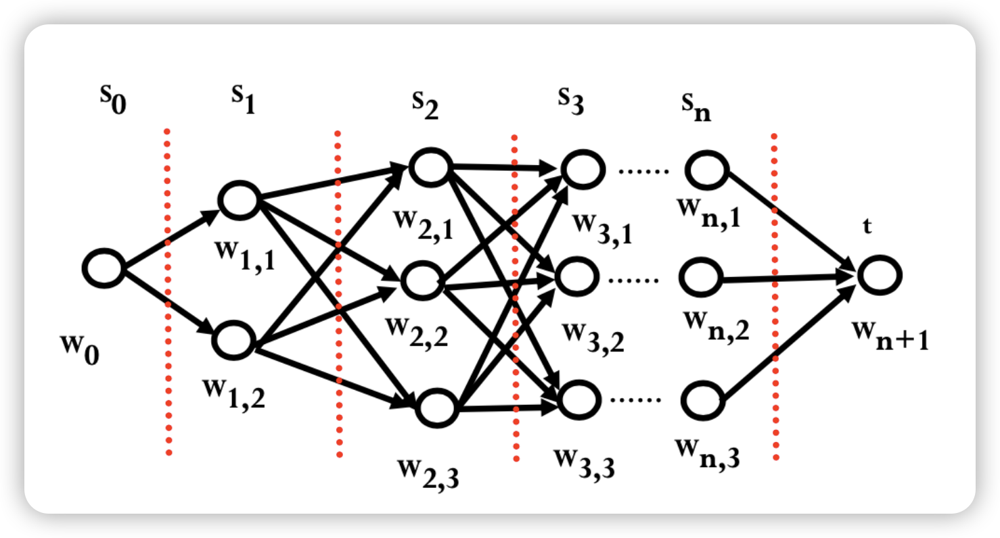

# 拼音输入法  实验报告

## 实验环境

实验环境中 Python 版本为 `Python 3.12.0`，依赖包如下：

|      包       |  版本  |
| :-----------: | :----: |
| `collections` |   -    |
|    `json`     | 2.0.9  |
|    `math`     |   -    |
|     `re`      | 2.2.1  |
| `subprocess`  |   -    |
|     `sys`     |   -    |
|    `time`     |   -    |
|    `tqdm`     | 4.66.1 |

实验项目文件结构如下：

```
Pinyin/Hand-in/
│  README.md
│
├─data
│  │  input.txt
│  │  output.txt
│  │
│  ├─lexicon
│  │      1st_2nd_order_characters.txt
│  │      pinyin2word.json
│  │      pinyin2word_all.txt
│  │
│  ├─sina_news_gbk
│  │      2016-04.txt
│  │      2016-05.txt
│  │      2016-06.txt
│  │      2016-07.txt
│  │      2016-08.txt
│  │      2016-09.txt
│  │      2016-10.txt
│  │      2016-11.txt
│  │      bi_word_count.json
│  │      README.txt
│  │      tri_word_count.json
│  │      uni_word_count.json
│  │
│  └─std_data
│          std_input.txt
│          std_output.txt
│
└─src
        pinyin.py
        preprocess.py
        test.py
```

以下均假设已经处于 `Pinyin/Hand-in/` 文件夹下，即：`./` 表示 `Pinyin/Hand-in/`。

## 数据预处理

本次实验使用的语料库为新浪新闻 2016 年的新闻语料库。数据预处理由两步构成：

1. 整理“拼音-词”对
2. 统计一元、二元和三元词的出现次数

整个数据预处理过程通过 `./src/preprocess.py` 完成：

```python
get_pinyin2word()  # 整理“拼音-词”对，获取 pinyin2word.json
get_word_count()  # 统计一元、二元和三元词的出现次数，获取 uni_word_count.json, bi_word_count.json 和 tri_word_count.json
```

### 整理“拼音-词”对

拼音汉字表（`./data/lexicon/pinyin2word_all.txt`）的格式如下：

```
a 啊 嗄 腌 吖 阿 锕
ai 锿 暧 爱 呆 嗌 艾 癌 哎 蔼 皑 砹 隘 碍 矮 埃 挨 捱 嫒 唉 哀 霭 嗳 瑷
```

这样的格式并不方便在程序中读取和使用，因此考虑将其转换为一个 JSON 文件：读取该文件中的每一行，将其以空格分割得到 `line_segments` 这一字符串列表，然后建立“拼音-词”对即可。代码实现如下：

```python
def get_pinyin2word():
    pinyin2word_mapping = {}
    with open('../data/lexicon/pinyin2word_all.txt', 'r', encoding='gbk') as file:
        for line in file:
            line_segments = line.strip().split()
            pinyin2word_mapping[line_segments[0]] = line_segments[1:]
    with open("../data/lexicon/pinyin2word.json", "w", encoding="utf-8") as json_file:
        json.dump(pinyin2word_mapping, json_file, ensure_ascii=False, indent=4)
```

最终整理得到“拼音-词”对（`./data/lexicon/pinyin2word.json`）的格式如下：

```json
{
    "a": [
        "啊",
        "嗄",
        "腌",
        "吖",
        "阿",
        "锕"
    ],
}
```

### 统计一元、二元和三元词的出现次数

从语料库出发，我们需要统计出所有的一元、二元和三元词的出现次数，分别整理成三个文件（`./data/lexicon/uni_word_count.json`、`./data/lexicon/bi_word_count.json` 和 `./data/lexicon/tri_word_count.json`），它们的格式如下：

```json
{
    "由中": 10126,
    "中国": 632362,
    "国高": 6913,
    "高等": 12702,
    "等教": 5328,
}
```

整体的思路是，首先利用语料库文件里的**非汉字字符**作为自然的分隔符，将整个语料切割为很多的语段，存入 `segments` 这一字符串列表中。紧接着，对于每个长度为 $i \quad (i = 1, 2, 3)$ 的字符串，更新其出现次数。

对于语料库中的多文件而言，枚举每个文件的文件名并分别对每个文件进行统计，统计数据累加即可得到整个语料库中所有的一元、二元和三元词的出现次数。代码实现如下：

```python
def get_word_count():
    uni_word_counter = defaultdict(int)
    bi_word_counter = defaultdict(int)
    tri_word_counter = defaultdict(int)

    # 枚举每个文件的文件名
    for i in tqdm(range(4, 12)):
        with open(f'../data/sina_news_gbk/2016-{str(i).zfill(2)}.txt', 'r', encoding='gbk') as file:
            for line in tqdm(file):
                try:
                    data = json.loads(line).get('html', "")

                    delimiter_pattern = re.compile(r'[^\u4e00-\u9fa5]+')
                    segments = delimiter_pattern.split(data)

                    for segment in segments:
                        # 去除空字符串
                        segment = segment.strip()
                        if not segment:
                            continue

                        # 截取长度为 1 的字符串
                        for j in range(len(segment)):
                            uni_word_counter[segment[j:j + 1]] += 1
                        # 截取长度为 2 的字符串
                        for j in range(len(segment) - 1):
                            bi_word_counter[segment[j:j + 2]] += 1
                        # 截取长度为 3 的字符串
                        for j in range(len(segment) - 2):
                            tri_word_counter[segment[j:j + 3]] += 1
                except:
                    pass

    # 将字典写入到 JSON 文件中
    with open("../data/sina_news_gbk/uni_word_count.json", "w", encoding="utf-8") as json_file:
        json.dump(uni_word_counter, json_file, ensure_ascii=False, indent=4)
    with open("../data/sina_news_gbk/bi_word_count.json", "w", encoding="utf-8") as json_file:
        json.dump(bi_word_counter, json_file, ensure_ascii=False, indent=4)
    with open("../data/sina_news_gbk/tri_word_count.json", "w", encoding="utf-8") as json_file:
        json.dump(tri_word_counter, json_file, ensure_ascii=False, indent=4)
```

## 基于字的二元、三元模型的拼音输入法

### 模型原理

#### 基本思路

设由所有拼音构成的集合为 $\mathscr{F}$，所有汉字构成的集合为 $\mathscr{G}$。

- 找到拼音和汉字之间的对应关系，找到某个拼音可以对应哪些汉字。

  形式化地，先求出映射 $\sigma: \mathscr{F} \to 2^{\mathscr{G}}$，其中 $2^\mathscr{G}$ 表示 $\mathscr{G}$ 的幂集。

- 找到 $k$ 个字连接的概率。

  形式化地，对于一个由 $k$ 个字构成的列表 $[w_{i-k+1}, \cdots, w_{i-1}, w_i]$ 而言，需要求出 $w_i$ 接在前 $k-1$ 个字后面的概率，即
  $$
  P(w_i | w_{i-k+1} \cdots w_{i-1}).
  $$

- 使用动态规划（Viterbi 算法）找到概率最大的句子。

#### 公式推导

对于 $n$ 个拼音构成的序列 $S=s_1s_2 · · · s_n$，需要确定每个单字拼音 $s_i$ 对应的中文字符 $w_i$，使得中文序列 $w_1w_2 · · · w_n$ 最佳。

借助现有的语料库，我们可以统计出任意中文字符串 $W$ 与输入串 $S$ 的匹配概率$P(S)$；该值越大，意味着输入串 $S$ 的输入结果更可能是 $W$。因此，最好的输入效果即最大化 $P(w_1 w_2 \cdots w_{n})$。而

$$
P(w_1 w_2 ... w_n) = P(w_1) \cdot P(w_2 | w_1) \cdot P(w_3 | w_1 w_2) \cdots P(w_n | w_1 w_2 \cdots w_{n-1}),
$$

故最大化 $P(w_1 w_2 \cdots w_{n})$ 等价于最大化

$$
\begin{align*}
\ln P(w_1 w_2 ... w_{n}) & = \ln P(w_1) + \ln P(w_2 | w_1) + \ln P(w_3 | w_1 w_2) + \cdots + \ln P(w_n | w_1 w_2 \cdots w_{n-1}) \\
& = \sum_{i = 1}^{n}\ln P(w_i | w_1w_2\cdots w_{i-1}).
\end{align*}
$$
在简化条件下，我们认为每个状态仅与前 $m - 1$ 个状态有关，因此只需考虑最大化 $\sum_{i = 1}^{n}\ln P(w_i|w_{i-m}\cdots w_{i-1})$​。

- 当 $m = 0$ 时，$P(w_i) = \dfrac{n(w_i)}{\sum_w n(w)}$ 表示 $w_i$ 的出现次数在所有单字 $w$ 的总出现次数之和中的占比。
- 当 $m = 1$ 时，称为“二元语法”，最大化 $\sum_{i = 1}^{n}\ln P(w_i|w_{i-1})$​​。

  对于每一项而言，$P(w_i | w_{i-1}) = \dfrac{P(w_{i-1}w_i)}{P(w_{i-1})} = \dfrac{n(w_{i-1}w_i)}{n(w_{i-1})}$，这里 $n(w_{i-1})$ 表示语料库中 $w_{i-1}$ 的出现次数，$n(w_{i-1}w_i)$ 表示语料库中 $w_{i-1}w_i$ 的出现次数。

- 当 $m = 2$ 时，称为“三元语法”，最大化 $\sum_{i = 1}^{n}\ln P(w_i|w_{i-2}w_{i-1})$​。

  对于每一项而言，$P(w_i | w_{i-2}w_{i-1}) = \dfrac{P(w_{i-2}w_{i-1}w_i)}{P(w_{i-2}w_{i-1})} = \dfrac{n(w_{i-2}w_{i-1}w_i)}{n(w_{i-2}w_{i-1})}$，这里 $n(w_{i-2}w_{i-1})$ 表示语料库中 $w_{i-2}w_{i-1}$ 的出现次数，$n(w_{i-2}w_{i-1}w_i)$ 表示语料库中 $w_{i-2}w_{i-1}w_i$ 的出现次数。

#### Viterbi 算法

考虑“三元语法”模型，该问题可进一步转化为求 $\sum_{i = 1}^{n}(-\ln P(w_i|w_{i-2}w_{i-1}))$ 的最小值。

建立栅栏图如下：其中 $w_0$ 为虚拟源点，$w_{n+1}$ 为虚拟汇点，汉字 $w_{i, j} \in \sigma(\mathscr{F}) \subset \mathscr{G}$ 为拼音 $s_i \in \mathscr{F}$ 所对应的第 $j$​ 个汉字。$w_{i-1, j}$ 与 $w_{i, k}$ 之间的边权满足
$$
\text{cost}(w_{i-1, j}, w_{i, k}) = \begin{cases}
-\ln(P(w_{i, k})), & \text{if } i = 1, \\
-\ln(P(w_{i, k}|w_{i-1, j})), & \text{if } i = 2, \\
\min\limits_{v \in \sigma(s_{i-2})}(-\ln(P(w_{i, k}|v \; w_{i-1, j})), & \text{if } 3 \le i \le n, \\
0, & \text{if } w_{i, k} = t.
\end{cases}
$$
设 $f(i, w)$ 表示从 $w_0$ 开始，到达第 $s_i$ 这一层对应的 $w$ 所需边权和的最小值。则
$$
f(i, w) = \max_{v \in \sigma(w)}(f(i - 1, v) + \text{cost}(v, w)).
$$


题目所求即为 $w_0$ 到 $w_{n+1}$ 的路径最小值，即为 $f(n+1, w_{n+1})$。

#### 实现过程

**进行平滑处理**：

对于一个由 $k$ 个字构成的列表 $[w_{i-k+1}, \cdots, w_{i-1}, w_i]$ 而言，
$$
P(w_i | w_{i-k+1} \cdots w_{i-1}) = \dfrac{P(w_{i-k+1} \cdots w_{i-1}w_i)}{P(w_{i-k+1} \cdots w_{i-1})}.
$$
若使用 `prefix` 表示字符串 $w_{i-k+1}\cdots w_{i-1}$，`word` 表示字符串 $w_{i-k+1} \cdots w_{i-1}w_i$，则可以计算该条件概率。但这个概率有可能为 $0$​，如果这样直接完全放弃该词语，会导致类似于这样的情况：由于“动物园”中的“物园”一词不存在，程序放弃“动物园”这一合理的猜测结果。

因此我们需要考虑平滑处理，设计参数 $\lambda$，迭代一次得到新的概率值：
$$
P(w_i | w_{i-k+1} \cdots w_{i-1}) \gets \lambda P(w_i | w_{i-k+1} \cdots w_{i-1})+(1-\lambda)P(w_i),
$$
其中 $P(w_i)$ 表示 $w_i$ 的出现次数与**所有单字总出现次数**的比值。它的意义在于，**考虑了单词最后一个字为单字的情况**，增强了前 $k - 1$ 个字组成的词与最后一个字之间的联系，增大了这类情况的概率占比。

代码实现如下：

```python
def get_probability(char_list):
    length = len(char_list)
    prefix = ''.join(char_list[0:-1])
    word = ''.join(char_list)

    if word in word_count[length] and prefix in word_count[length - 1]:
        current_probability = word_count[length][word] / word_count[length - 1][prefix]
    else:
        current_probability = 0
    return my_lambda * current_probability + \
        (1 - my_lambda) * word_count[1].get(char_list[-1], 0) / total_count
```

由于计算 `math.log(0)` 时 Python 会因报错而异常退出，故我实现了下面这个函数：

```python
def get_weight(x):
    return float('inf') if x == 0 else -math.log(x)
```

**回答每次询问**：

对于栅栏图的构建以及 Viterbi 算法而言，

- 首先预处理出前两层的 $f$ 值，其中：
  - 第一层的 $f$ 值设置为**该字出现次数**在**同拼音汉字总出现次数**的占比，
  - 第二层的 $f$ 值设置为利用二元模型得到的 $f$​ 值。
  - 其余层的 $f$ 值均设置为正无穷。
- 接着，
  - 如果是二元模型，则枚举相邻两层的字并计算边权，在转移的时候同时记录前驱。
  - 如果是三元模型，则枚举连续三层的字并计算边权，在转移的时候同时记录前驱。
- 最后从最后一层 $f$ 值最大的字开始沿着前驱回溯，依次拼接，得到倒序的答案序列。

```python
def solve(pinyins, opt):
    f = {}
    pred = {}
    levels = len(pinyins)

    # 初始化各值和前驱
    for i in range(len(pinyins)):
        f[i] = {}
        pred[i] = {}
        for char in pinyin2word[pinyins[i]]:
            f[i][char] = float('inf')
            pred[i][char] = None

    # 将第一个拼音对应的状态设为 -ln(频率)
    for char1 in pinyin2word[pinyins[0]]:
        f[0][char1] = get_weight(word_count[1].get(char1, 0) / uni_pinyin_count[pinyins[0]])

    # 将第二个拼音对应的状态设为二元模型得到的状态
    for char2 in pinyin2word[pinyins[1]]:
        for char1 in pinyin2word[pinyins[0]]:
            if f[0][char1] + get_weight(get_probability([char1, char2])) < f[1][char2] or pred[1][char2] is None:
                f[1][char2] = f[0][char1] + get_weight(get_probability([char1, char2]))
                pred[1][char2] = char1

    # 使用二元模型
    if opt == 2:
        for i in range(2, levels):
            pinyin1 = pinyins[i - 1]
            pinyin2 = pinyins[i]
            for char2 in pinyin2word[pinyin2]:
                for char1 in pinyin2word[pinyin1]:
                    if f[i - 1][char1] + get_weight(get_probability([char1, char2])) < f[i][char2] or pred[i][char2] is None:
                        f[i][char2] = f[i - 1][char1] + get_weight(get_probability([char1, char2]))
                        pred[i][char2] = char1

    # 使用三元模型
    if opt == 3:
        for i in range(2, levels):
            pinyin1 = pinyins[i - 2]
            pinyin2 = pinyins[i - 1]
            pinyin3 = pinyins[i]
            for char3 in pinyin2word[pinyin3]:
                for char2 in pinyin2word[pinyin2]:
                    for char1 in pinyin2word[pinyin1]:
                        if f[i - 1][char2] + get_weight(get_probability([char1, char2, char3])) < f[i][char3] or pred[i][char3] is None:
                            f[i][char3] = f[i - 1][char2] + get_weight(get_probability([char1, char2, char3]))
                            pred[i][char3] = char2

    # 从最后一个拼音开始回溯
    final_word = None
    for char in pinyin2word[pinyins[levels - 1]]:
        if final_word is None or f[levels - 1][char] < f[levels - 1][final_word]:
            final_word = char
    elem = final_word
    sentence = []
    for i in range(levels - 1, -1, -1):
        sentence.append(elem)
        elem = pred[i][elem]

    # 返回由列表反转顺序后连接而成的答案
    print(''.join(reversed(sentence)))
```

**主函数**：

在主函数中读入预处理后的数据，同时计算各拼音汉字总出现次数，以及所有单字总出现次数。

对于标准输入的每一行而言，通过调整 `solve()` 函数的第二个参数为 `2` 还是 `3` 来控制使用二元模型还是三元模型。

```python
if __name__ == '__main__':
    pinyin2word = load_list_from_json('../data/lexicon/pinyin2word.json')

    word_count[1] = load_list_from_json('../data/sina_news_gbk/uni_word_count.json')
    word_count[2] = load_list_from_json('../data/sina_news_gbk/bi_word_count.json')
    word_count[3] = load_list_from_json('../data/sina_news_gbk/tri_word_count.json')

    # 删除出现次数 <= k 的词
    keys_to_delete = []
    for idx in range(1, 4):
        for key_, value_ in word_count[idx].items():
            if value_ <= my_k:
                keys_to_delete.append((idx, key_))  # 将待删除的键添加到列表中
    # 在迭代结束后删除待删除的键
    for idx, key_ in keys_to_delete:
        del word_count[idx][key_]

    uni_pinyin_count = get_pinyin_count(pinyin2word)
    total_count = sum(uni_pinyin_count.values())

    # 测量总响应时长
    total_response_time = 0

    for input_line in sys.stdin:  # 输入 'qing hua da xue'
        input_line = input_line.strip()
        if not input_line:  # 如果读取到空行，跳过
            break
        # 测量单次响应时长
        start_time = time.time()
        # solve(input_line.split(), 2)
        solve(input_line.split(), 3)
        end_time = time.time()

        total_response_time += end_time - start_time

    sys.stderr.write(str(total_response_time))
```

### 实验效果

运行项目中的测试程序（`./src/test.py`）可以得到对于测试集（`./data/std_data/std_input.txt`）而言的实验效果：

|     评价指标     |       二元模型       |       三元模型       |
| :--------------: | :------------------: | :------------------: |
|     句准确率     |      $38.92\%$       |      $46.51\%$       |
|     字准确率     |      $83.72\%$       |      $87.53\%$       |
|    训练时长*     | $10.5\;\mathrm{min}$ | $10.5\;\mathrm{min}$ |
| 平均单次响应时长 | $0.0135\;\mathrm{s}$ | $0.5909\;\mathrm{s}$ |
|    总响应时长    | $6.801\;\mathrm{s}$  | $296.1\;\mathrm{s}$  |

> *训练时长（指预处理数据所用时长）由对数据预处理程序（`./src/preprocess.py`）单独测试而得。

- 一方面而言，三元模型无论是在句正确率还是在字准确率上，相比于二元模型都有了不小的提升。
- 但是另一方面而言，三元模型由于数据量的增加，以及在状态转移时多枚举了一层循环，所以平均单次响应时长（以及总响应时长）有了较大幅度的增加。

### 案例分析

#### 效果较好

> **题目**：`gao kao cheng ji zai jin tian shang wu gong bu`
>
> **正确答案**：`高考成绩在今天上午公布`

> **题目**：`wo men dou you guang ming de wei lai`
>
> **正确答案**：`我们都有光明的未来`

在这两个例子中，二元和三元模型均能给出正确答案，我认为原因有二：

1. **词汇简单，均为高频词**

   诸如“高考”“成绩”“我们”等词汇都是生活中常见词汇，出现频率高，因此导致模型表现较好。

2. **词汇长度较短**

   由于“光明”“未来”“今天”“上午”这些词都由二元词汇构成，字与字之间前后关联距离较短，因此二元模型和三元模型均能较好地处理这些情况。

#### 效果较差

> **题目**：`yi qing yi lai di yi ci zai wai jiu can`
>
> **正确答案**：`疫情以来第一次在外就餐`
>
> **我的答案（二元模型）**：`疫情以来的一次在外就餐`
>
> **我的答案（三元模型）**：`疫情以来的依次在外就餐`

此例中出现了**多音字的混淆问题**。由于在数据预处理过程中并没有对“的”到底是“de”还是“di”进行区分，所以导致了这样的问题。一个更好的解决办法是在训练语料库中额外添加每个多音字（及其常见词组）的拼音，以此来区分多音字各个不同读音的词频。

> **题目**：`xiang guo he ma la tang dou hen shou huan ying`
>
> **正确答案**：`香锅和麻辣烫都很受欢迎`
>
> **我的答案（二元模型）**：`向国和麻辣汤都很受欢迎`
>
> **我的答案（三元模型）**：`香果喝麻辣烫都很受欢迎`

此例中着重比较的是**二元模型和三元模型在句子含有三元词群的时候的不同表现**。可以看出，三元模型能够正确处理出“麻辣烫”这一词组，但是二元模型只能考虑到”麻辣“和”辣汤“等词的组合。这说明，三元模型在更长词群的句子中有更大优势。


> **题目**：`hua hua yun dong yuan yu sheng jie xian`
>
> **正确答案**：`花滑运动员羽生结弦`
>
> **我的答案（二元模型）**：`化化运动员与省戒线`
>
> **我的答案（三元模型）**：`画画运动员与省界线`

此例中出现的问题源于**训练语料的不足**。由于”羽生结弦“的出现次数过少，以及”花滑“这一表述在训练语料中并不常见，所以无论是二元模型还是三元模型均不能给出较为满意的答案。

### 参数选择与性能分析

#### 平滑处理参数

平滑处理的参数 $\lambda$ 可以有不同取值，$\lambda$ 越大，表明认为不存在某个词 $AB$ 的情况下，$A$ 恰为上个词的结尾，$B$ 恰为下个词的开头的概率越低。对于二元模型而言，在不同 $\lambda$ 下的测试结果如下（$k = 1$）：

| 评价指标 | $\lambda = 0.9$ | $\lambda = 0.8$ | $\lambda = 0.95$ |
| :------: | :-------------: | :-------------: | :--------------: |
| 句准确率 |    $38.92\%$    |    $37.72\%$    |    $38.72\%$     |
| 字准确率 |    $83.72\%$    |    $83.61\%$    |    $83.64\%$     |

经过测试，$\lambda = 0.9$ 的效果最佳。这说明在 $\lambda$ 适中的情况下，能够兼顾二字词出现次数以及前后两个词的连接。

#### 预处理中的词频阈值

在对数据预处理的过程中，会有很多出现次数过少的无用词，而它们可能会对最终结果产生影响。因此，我们可以考虑删去出现次数过低的词语。假设删去出现次数小于等于 $k$ 的词语。对于三元模型而言，在不同 $k$ 下的测试结果如下（$\lambda = 0.9$）：

| 评价指标 |  $k = 1$  |  $k = 0$  |  $k = 5$  |
| :------: | :-------: | :-------: | :-------: |
| 句准确率 | $46.51\%$ | $42.91\%$ | $42.32\%$ |
| 字准确率 | $87.53\%$ | $86.22\%$ | $86.65\%$ |

经过测试，$k = 1$ 的效果最佳。这说明在 $k$ 合适的情况下，能够除去大多数无用词汇的同时，保证出现次数较低的有意义的词汇并不被舍去。

### 时间和空间复杂度分析

#### 时间复杂度

二元模型的 Viterbi 算法的时间复杂度为 $O(nm^2\log^2m\log K)$，其中 $n$ 为输入的拼音个数，$m$​ 为每个拼音平均所对应汉字的总可能数，$K$​ 表示“词语-出现次数”的 `dict` 的大小。

由于在代码实现上，$f$ 值使用的是一个 `dict`，故时间复杂度里含有平衡树查询操作带来的 $\log^2m$​ 项。$\log K$ 是因为在 `get_probability` 函数中，查询了 `dict` 类型的 `word_count` 共常数次。

三元模型的 Viterbi 算法的时间复杂度为 $O(nm^3\log^3m\log K)$，具体的分析同理于二元模型。

#### 空间复杂度

构建并存储 $f$ 值和前驱需要 $O(nm)$ 的空间复杂度，其中 $n$ 为输入的拼音个数，$m$ 为每个拼音平均所对应汉字的总可能数。

#### 对运算时间的估测

测试集中每条测试数据的 $n$ 约为 $8$ 左右，整个语料数据集中 $m$ 约为 $25$，$K$ 约为 $4 \times 10^6$。假设电脑 $1\;\mathrm{s}$ 可以进行 $10^8$ 次运算：

- 二元模型平均单次响应时长约为 $\dfrac{8 \times 25^2 \times \ln^2 25 \times \ln(4\times 10^6)}{10^8} \approx 0.0079\;\mathrm{s}$，与实际测得的 $0.0135\;\mathrm{s}$ 较为接近；
- 三元模型平均单次响应时长约为 $\dfrac{8 \times 25^3 \times \ln^3 25 \times \ln(4\times 10^6)}{10^8} \approx 0.6337\;\mathrm{s}$，与实际测得的 $0.5909\;\mathrm{s}$ 较为接近。

## 感受及建议

### 感受

经过本次实验，我深刻理解了二元和三元模型背后的理论背景，也动手实现了 Viterbi 算法，最终得出了一个可以正常运行的“拼音输入法”。

在完成代码的过程中，我发现将代码模块化是一个特别好的习惯。我在编写代码的过程中重构了部分作用相似、结构相似的函数，提高了代码复用率；我同时在代码中添加适当的注释，让代码易于理解和维护，**这大大减少了我花在调试上的时间**。

实验过程中我发现，更多元的模型会有更好的效果，但同时也会带来更大的负载压力。同时，不同的参数设置在不同模型中取得的效果可能会有较大差别，对于参数的调整是十分有必要的，例如如何设定 $\lambda$、$k$ 等参数。

我在完成这个实验之后手动测试了一些数据，得出正确结果的时候的我获得的成就感是无法比拟的。感谢这次作业，给我提供了一次人工智能相关实践的练手的机会。

### 建议

由于测试集中有很多以前选课同学众包的句子，其中不乏很多近年来才出现的新闻、事件以及网络用语，因此建议在语料库中添加部分**近年**来的文章，这样可能会使最终的测试结果更好。
